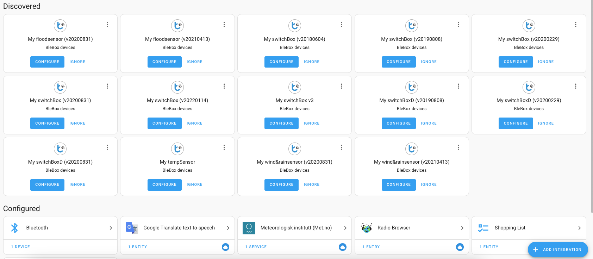

# fakebox

Blebox device simulator for local network with zeroconf service discovery built-in.

## Install & usage

Install dependencies:

    python3.12 -m venv .
    source bin/activate
    pip install -U pip wheel
    pip install -r requirements.txt

Run it:

    flask --app devices.<device-name> run

Above will start specified device type simulator on default flask port (5000).

Device ids are constant and interpolated from the device type and api version (i.e. api
level). This makes sure you can use different device API variants simultanously with
systems like [Home Assistant](https://github.com/home-assistant).

## Running all simulators

If you want to run all available simulators as a suite use the provided bash script:

    ./all.sh

Above will start multiple Flask servers with ports preassigned to specific
`(device, api version)`:

    $ ./all.sh
    port[5001]: switchboxd_20190808
    port[5002]: switchboxd_20200229
    port[5003]: switchboxd_20200831
    port[5011]: switchbox_20180604
    port[5012]: switchbox_20190808
    port[5013]: switchbox_20200229
    port[5014]: switchbox_20200831
    port[5015]: switchbox_20220114
    port[5021]: floodsensor_20200831
    port[5022]: floodsensor_20210413
    port[5031]: windrainsensor_20200831
    port[5032]: windrainsensor_20210413
    (...)

If you're running on macOS, the `all.sh` script will automatically register simulators
via zeroconf (using `dns-sd` command). This allows zeroconf-enabled systems to discover
devices and simplify configuration.

Following is example result of zeroconf discovery in Home Assistant:

## Contributions

Contributions are welcome. Look around the code and try to follow established patterns.
No strict rules. Copy and paste allowed :D
